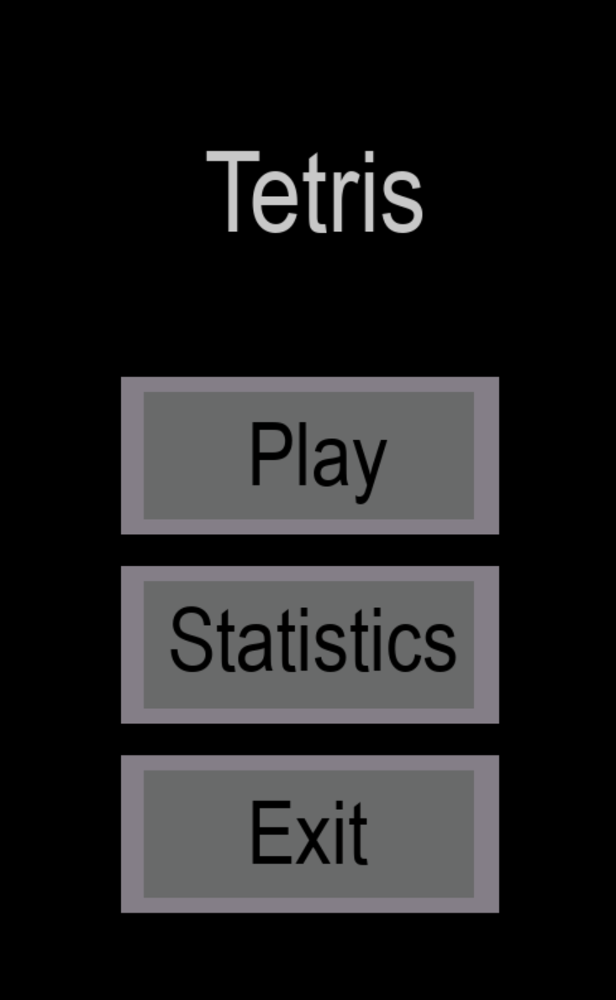
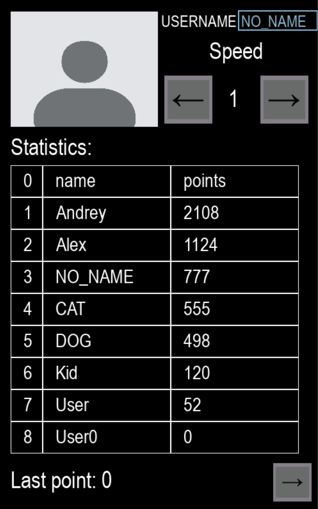
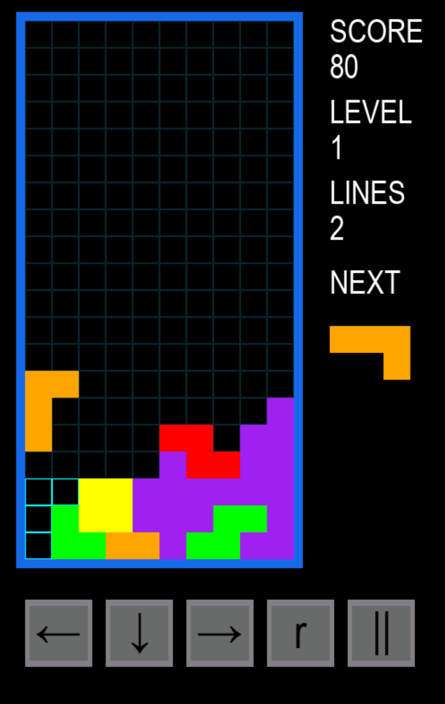
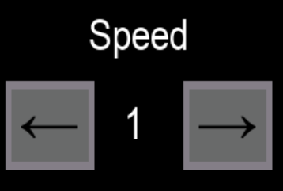
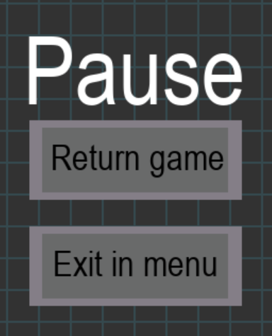

# Tetris

Данный репозиторий был создан в рамках написания курсовой по дисциплине «Программирование». Классическая реализация игры
«Тетрис» на Python с использованием ассемблера.

## Запуск

Для начала необходимо установить внешние зависимости с помощью команды:

    $ pip install -r requirements.txt

После чего можно запустить "main.py"

На UNIX/Linux/MacOS:

    $ ./main.py

или

    $ python3 main.py

На Windows:

    $ python3 main.py

## Интерфейс

|             Меню              |             Окно статистики             |             Игра              |
|:-----------------------------:|:---------------------------------------:|:-----------------------------:|
|  |  |  |

### Меню

Меню включает три кнопки, каждая из которых ведет к соответствующему окну.

|   Кнопка   |            Действие            |
|:----------:|:------------------------------:|
|    Play    |         Запускает игру         |
| Statistics | Открывает окно со статистикой. |
|    Exit    |         Выход из игры          |

### Окно статистики

Здесь показано ваше имя и начальная скорость при запуске игры. Ниже представлена таблица с восемью лучшими результатами.
А еще ниже вы можете увидеть результаты последней игры.

В этом окне можно изменить свое имя. Просто кликните по текущему имени, введите новое и нажмите в любом другом месте,
чтобы сохранить изменения. Обратите внимание, что имя может содержать не более восьми символов.

Ниже можно настроить начальную скорость блоков через две кнопки. Левая кнопка снижает уровень, правая - повышает его на
единицу. Минимальный уровень - первый, максимальный - десятый.

Ниже представлена таблица рекордов и ваш последний результат. Вы можете выйти из этого окна двумя способами: нажать на
крестик или на стрелку в правом нижнем углу.

### Игра

Сама игра представляем собой классический «Тетрис». Блоки падают сверху. Вы можете вращать их вправо и влево,
поворачивать по часовой стрелке и опускать вниз. Слева показаны ваши результаты, а снизу находятся кнопки управления.

Блоками можно управлять двумя способами: с помощью кнопок и клавиш на клавиатуре.

| Кнопка | Клавиша |           Действие           |
|:------:|:-------:|:----------------------------:|
|   ←    |    ←    |      Двигает блок влево      |
|   ↓    |    ↓    |     Двигает блок вправо      |
|   →    |    →    |      Двигает блок вниз       |
|   r    |    ↑    | Поворачивает блок по часовой |
|   ⏸    |   Esc   |     Ставит игру на паузу     |

### Пауза

Если поставить игру на паузу, она остановится, и экран станет серым. На нем появится надпись и две кнопки: "вернуться"
и "выйти в меню".

## ⚙️ Возможности

- Классическое игровое поле 10x20;
- 7 стандартных фигур (тетрамино) с поворотами;
- Система учета очков и рекордов (сохранение в файл);
- Увеличение скорости с каждым уровнем;
- Предпросмотр следующей фигуры (Next Piece);
- Управление клавиатурой и кнопками;
- Пауза и сброс игры.

## Архитектура проекта

- `main.py` - точка входа, инициализация игрового цикла.
- `data/script/`
-
    - `menu.py` - инициализация меню.
-
    - `statistics_window.py` - инициализация окна статистики и функции для работы с файлами.
-
    - `blocks_sprite.py` - класс фигуры, логика вращения, формы. Игровое поле (матрица 20x10), логика проверки
      столкновений
      и удаления линий.
-
    - `button.py` - класс кнопки, который обрабатывает нажатие и наведение.
-
    - `visual.py` - отрисовка графики.
-
    - `image_func.py` - функция для загрузки изображений.
-
    - `constants.py` - файл с константами.
- `data/script/asm`
-
    - `clear_map.c` - заголовочный файл для ассемблера.
-
    - `clear_map.S` - файл с ассемблерными функциями, которые используются в `blocks_sprite.py` для очистки карты и
      проверки событий.
- `data/image` - хранение изображений
- `data/music` - хранение музыки
- `data/txt` - хранение текстовых файлов

## Особенности реализации

### 1. Система рекордов с оптимизацией памяти

- Таблица лидеров хранит данные **только для восьми лучших игроков**.
- При добавлении нового результата происходит сравнение с существующими записями. Если результат входит в топ-8, он
  вставляется на соответствующую позицию, а "вытесненный" худший результат удаляется.
- Такой подход позволяет **минимизировать объем хранимых данных** и исключает необходимость хранения всей истории игр,
  что снижает нагрузку на память и ускоряет операции чтения/записи.

### 2. Гибкая система управления игроком

- Реализовано **окно смены имени** игрока.
- Имя сохраняется в текущей сессии и используется при записи нового рекорда. Это позволяет нескольким пользователям
  играть на одном устройстве без необходимости перезапуска программы.

### 3. Алгоритм вращения фигур

- Вращение реализовано через **матричное преобразование координат**.
- Для каждой фигуры определены **четыре пространственных положения** (0°, 90°, 180°, 270°), которые вычисляются
  динамически, а не задаются жестко.
- Такой подход исключает хардкод координат и делает код легко расширяемым.

### 4. Оптимизированная система отрисовки (без спрайтов)

- **Отсутствие спрайтовых атласов** и загрузки внешних изображений — вся графика рендерится программно.
- Игровое поле представляет собой **сетку из клеток (блоков)** фиксированного размера.
- **Логика отрисовки каждой клетки:**
    - Если клетка **пустая** → рисуется прямоугольная **рамка** (контур), что визуально обозначает границы игрового поля
      без излишней загрузки графики.
    - Если клетка **заполнена** (принадлежит "замороженной" фигуре или текущей падающей фигуре) → рисуется **залитый
      блок** с цветом, соответствующим типу фигуры

### 5. Дополнительные технические решения

- **Удаление заполненных строк** реализовано через ассемблер для оптимальной
  производительности.
- **Сохранение рекордов** осуществляется в txt-файл, что обеспечивает человекочитаемость и простоту редактирования при
  необходимости.
- **Проверка на заполнение целой линии и сдвиг блока вниз** реализованы через ассемблер для оптимизации и повышения
  скорости кода.

## Заключение

В ходе курсовой работы была разработана полноценная игра «Тетрис». Реализована вся базовая игровая механика, система
сохранения рекордов и удобный графический интерфейс. 